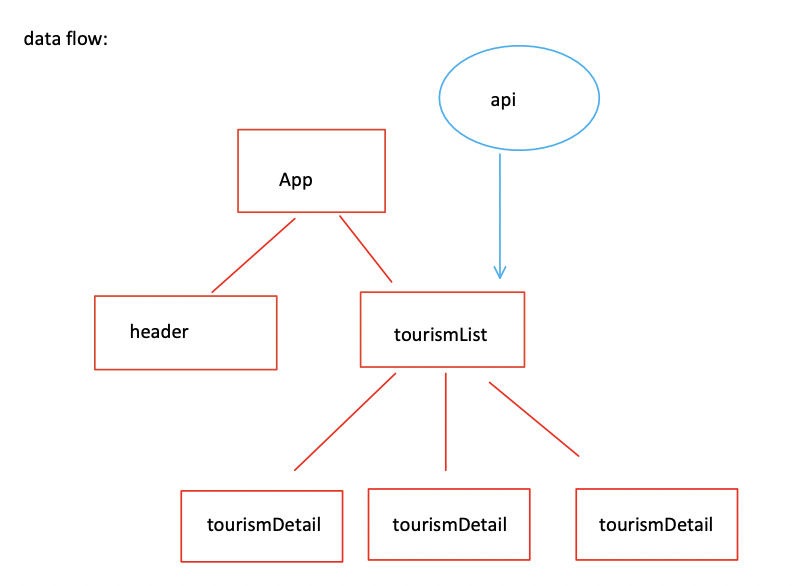
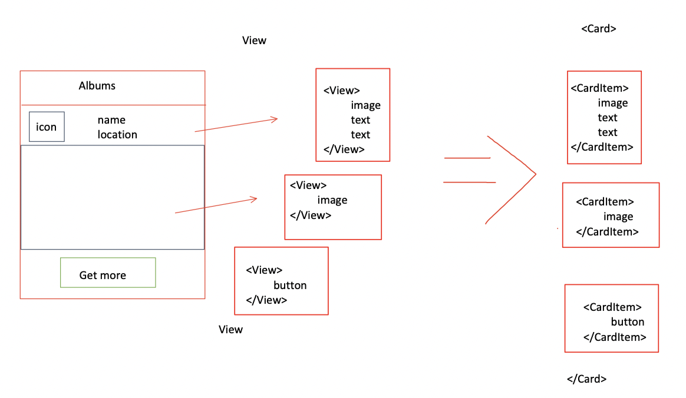

Tourism App
===
### In This Project
1. axios
2. pass children as props
3. pass function as props
4. Linking
5. ScrollView

### Data Flow

### Structure

### Demo

### Ref 
1.  https://www.udemy.com/course/the-complete-react-native-and-redux-course/learn/lecture/25725804#notes
2.  https://medium.com/altotech/getting-started-with-react-native-1112bbbb3fb0